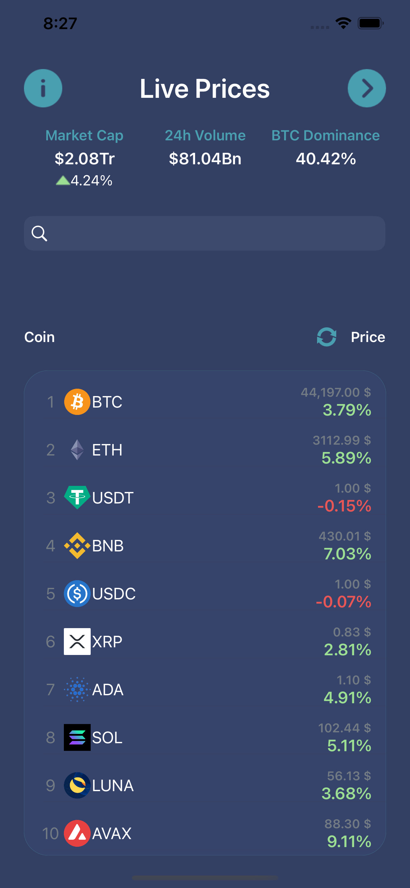
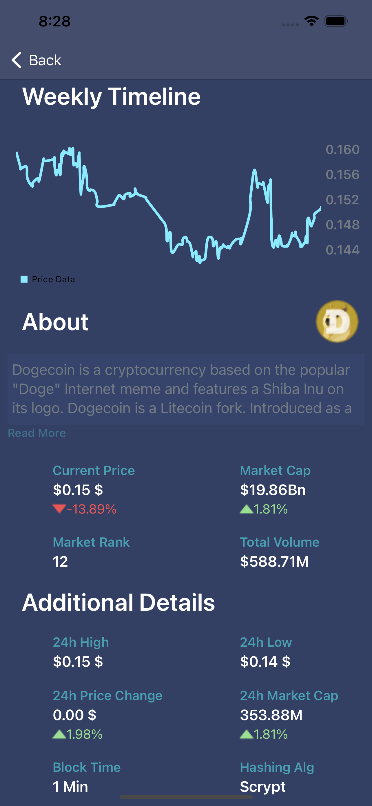
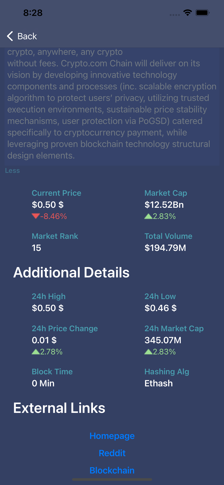
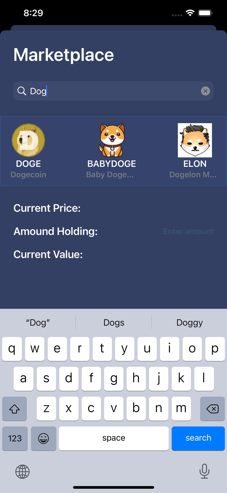
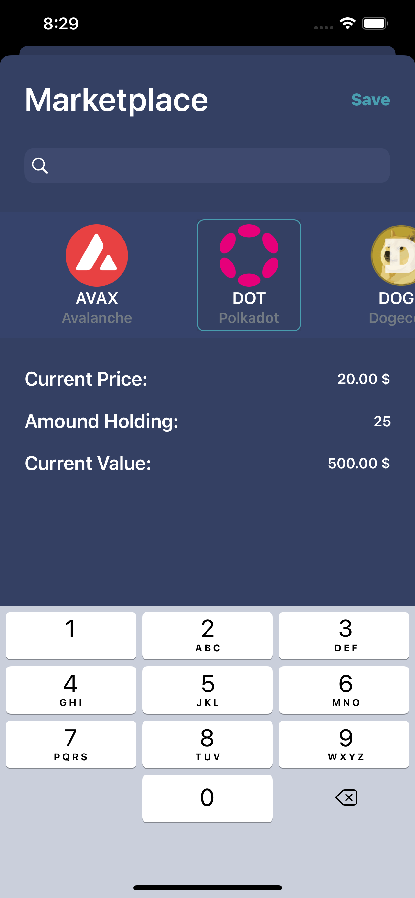
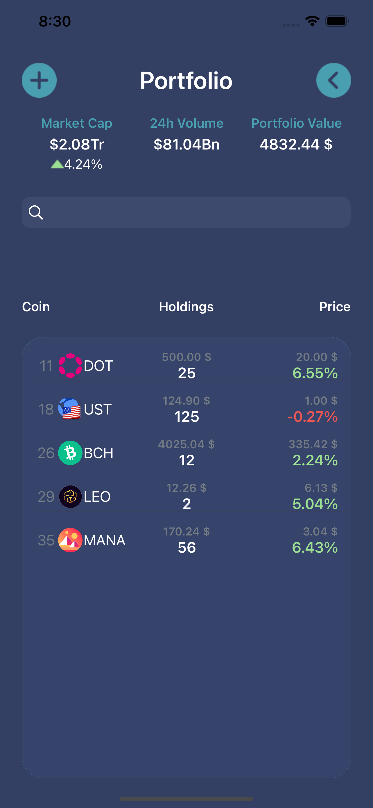

<!-- PROJECT LOGO -->
<br />
<div align="center">
  <a href="https://github.com/github_username/repo_name">
    
  </a>

<h3 align="center">Crypto tracker app</h3>

  <p align="center">
    A simple cryptocurrency tracking app
  </p>
</div>


<!-- TABLE OF CONTENTS -->
<details>
  <summary>Table of Contents</summary>
  <ol>
    <li>
      <a href="#about-the-project">About The Project</a>
      <ul>
        <li><a href="#built-with">Built With</a></li>
      </ul>
    </li>
    <li>
      <a href="#getting-started">Getting Started</a>
      <ul>
        <li><a href="#prerequisites">Prerequisites</a></li>
        <li><a href="#installation">Installation</a></li>
      </ul>
    </li>
    <li><a href="#usage">Usage</a></li>
    <li><a href="#roadmap">Roadmap</a></li>
  </ol>
</details>


<!-- ABOUT THE PROJECT -->
## About The Project

    </br>        </br>      
    </br>        </br>      


I created this app with a different architectural approach and without storyboards, and I think it was successful. While building this app I've used everything I learned so far.
It's a simple app that fetches crypto data from Coingecko free API and distributes it accordingly throughout the app.
I also did some manipulation to filter with UISearchbar and sort arrays of data according to button actions

while working on this app I've learned/ mastered: 
* MVVM architectural pattern
* Generic observable objects to bind VC to it's viewmodel
* Communication patterns with closures


Libraries I've used:
* Charts
* UIKit


<p align="right">(<a href="#top">back to top</a>)</p>


### Built With

* Xcode 13
* Swift programming language

<p align="right">(<a href="#top">back to top</a>)</p>


### Installation

1. Clone the repo
   ```sh
   git clone https://github.com/Sevenfortyseven/CryptoTrackerApp
   ```


<p align="right">(<a href="#top">back to top</a>)</p>


<!-- ROADMAP -->
## Roadmap

- [ ] Integrate CoreData
- [ ] User Authentication


